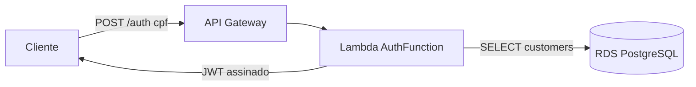

# tech-challenge-fase3-serverless-auth — Autenticação por CPF (Function Serverless)

Função **AWS Lambda** que autentica o cliente pelo **CPF** e emite um **JWT** para consumo das APIs protegidas. É o coração do requisito de segurança da Fase 3.

## Propósito

Receber o CPF, **validar os dígitos verificadores**, **consultar a existência e o status** do cliente na base (`customers`) e, se autorizado, **gerar um token JWT** assinado com o mesmo segredo da aplicação principal. Exposta pelo API Gateway em `POST /auth`.

## Tecnologias

- **AWS Lambda** (Node.js 18)
- **AWS SAM** (empacotamento e deploy — `template.yaml`)
- `pg` (acesso ao PostgreSQL) e `jsonwebtoken` (emissão do JWT)

> Repositório **sem Dockerfile** — a função é empacotada pelo SAM, não há necessidade técnica de contêiner.

## Pré-requisitos

- AWS SAM CLI e credenciais AWS
- Acesso ao RDS a partir da VPC (a função roda **dentro da VPC**)

## Contrato da API

`POST /auth`

```json
// Request
{ "cpf": "529.982.247-25" }

// 200 OK
{ "message": "Autenticação realizada com sucesso", "token": "<JWT>" }
```

Respostas de erro: `400` (CPF inválido), `404` (cliente não encontrado), `403` (cliente inativo).

Uso do token: `Authorization: Bearer <JWT>` nas rotas protegidas da aplicação.

## Deploy

Feito pela pipeline; manualmente:

```bash
sam build
sam deploy --stack-name oficina-auth-stack --resolve-s3 \
  --capabilities CAPABILITY_IAM --no-confirm-changeset --no-fail-on-empty-changeset
```

Configuração relevante no `template.yaml`:
- `Environment.Variables.DATABASE_URL` — conexão com o RDS;
- `Environment.Variables.JWT_SECRET` — **igual ao da aplicação** (senão o token é rejeitado);
- `VpcConfig` — subnets e security group para alcançar o RDS **privado**.

## Pipeline de CI/CD (GitHub Actions — `.github/workflows/deploy.yaml`)

Disparada no merge para `main` (branch protegida, via Pull Request):
`checkout` → `npm install` → credenciais AWS → **`sam build`** → **`sam deploy`** (atualiza a Lambda automaticamente).

Secrets: `AWS_ACCESS_KEY_ID`, `AWS_SECRET_ACCESS_KEY`, `AWS_SESSION_TOKEN`.

## Arquitetura do componente



## Observações de rede (importante)

O RDS é **privado**. Para a Lambda conectar, ela roda na mesma subnet do banco e usa o Security Group do RDS. Esse SG precisa ter **regra de saída (egress)** liberada — sem ela, a conexão dá `ETIMEDOUT` (ver ADR-004 e o README do `infra-db`).
